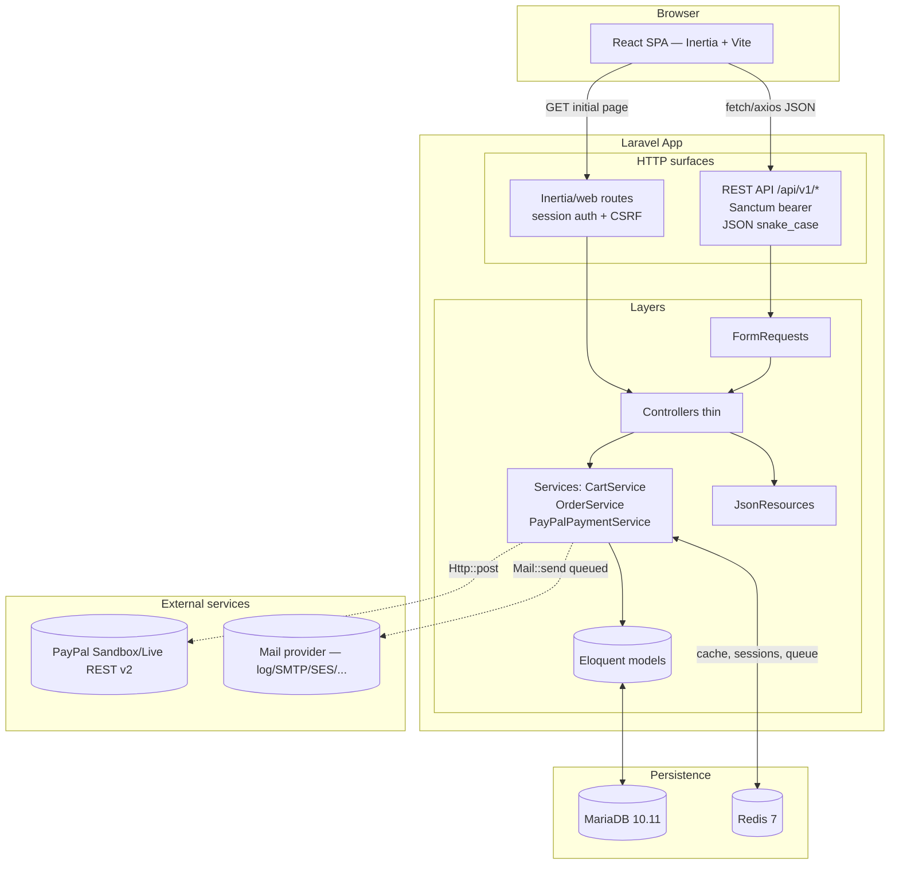
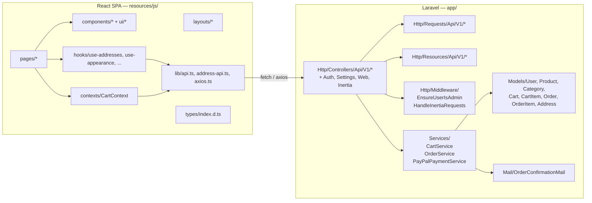
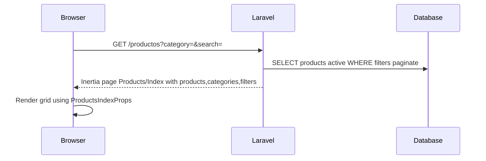
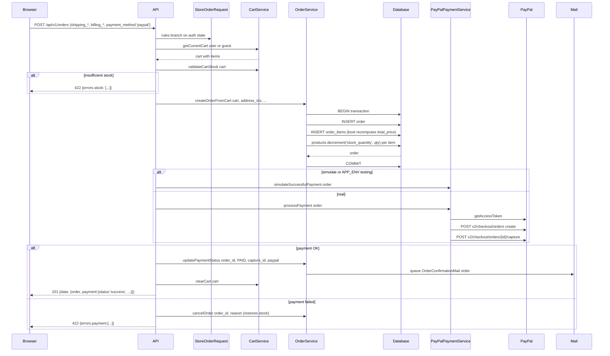

# Architecture — CronosMatic Store

> Generated: 2026-05-07 — Code-derived synthesis. Companion docs: [data-models.md](./data-models.md), [api-contracts.md](./api-contracts.md), [source-tree-analysis.md](./source-tree-analysis.md), [component-inventory.md](./component-inventory.md).

## 1. Executive summary

CronosMatic Store is a **Laravel 12 + React 19 monolith** delivering a B2C watch e-commerce MVP. It is built on the official Laravel + React + Inertia.js starter kit, but the e-commerce feature set is intentionally implemented as a **dedicated REST API at `/api/v1/`** (Sanctum-authenticated for protected operations) consumed by the same React frontend. The starter-kit web routes (login, dashboard, settings) coexist alongside, sharing the same Eloquent models. Business logic is centralized in three services (`CartService`, `OrderService`, `PayPalPaymentService`); controllers stay thin and use `FormRequest` for validation and `JsonResource` for response shaping.

The MVP runs in MXN, ships with a sandbox PayPal integration, is fully containerized via Docker Compose (5 services), and is verified by a 138-test suite (PHPUnit + Vitest + Cypress).

## 2. Technology stack

See [project-overview.md §3](./project-overview.md#3-tech-stack-summary) for the full table. One-liner: **Laravel 12 (PHP 8.2+) + Sanctum + Inertia 2 + Eloquent on MariaDB 10.11 + Redis 7 + React 19 + TypeScript 5 + Vite 6 + Tailwind 4 + Shadcn/Radix + PayPal v2 REST**.

## 3. Architecture pattern

### 3.1 Style

**Layered Laravel monolith with two parallel HTTP surfaces.** Both surfaces share the same Eloquent models, services, and database; they differ only in their authentication and serialization strategies.



### 3.2 Why two surfaces

The starter kit comes wired for Inertia (server-rendered React, session auth, CSRF). Reimplementing auth and dashboards on top of pure REST would be wasteful, but Inertia's "every interaction is a full page navigation" model is awkward for the cart, dynamic catalog filtering, and the admin panel. The chosen split:

- **Inertia / web** for: `/`, `/productos[/{slug}]`, `/carrito`, `/checkout`, `/orders/confirmation/{n}`, `/dashboard`, `/user/orders[/{n}]`, `/settings/*`, `/login`, `/register`, etc.
- **REST API (`/api/v1/`)** for: data refresh during cart updates, checkout submission, order history, all admin CRUD, payment orchestration, image upload.

In addition, two pragmatic exceptions exist (documented in `docs/BACKEND_DISCREPANCIES.md`):

1. **Address book endpoints** (`/api/v1/user/addresses`) live in `routes/web.php` under session/`auth` middleware — the SPA already has a session, so reusing CSRF + cookies is simpler than minting Sanctum tokens just for address management.
2. **Cart endpoints** (`/api/v1/cart/*`) and `POST /api/v1/orders` are declared in `routes/api.php` but wrapped in the `web` middleware group, so they accept session cookies and require CSRF. The frontend additionally sends an `X-Session-ID` header to keep guest carts tied to a stable id even when CSRF/session rotates.

## 4. Component view



### 4.1 Backend layering rules

- **Controllers** orchestrate; they don't hold business logic and never validate inline. Each REST controller method goes: type-hinted `FormRequest` (validation) → `Service` call → `JsonResource`.
- **Services** are stateless, transactional. Anything that touches multiple tables runs inside `DB::transaction(fn () => …)`. Errors are surfaced as exceptions (`InvalidArgumentException` for client-fixable errors, generic `\Exception` for unexpected ones).
- **Models** carry the schema, relationships, and small invariant helpers (status labels, `canBeCancelled`, accessors). The `Address` and `OrderItem` models also use `boot` callbacks to enforce invariants — see [data-models.md §lifecycle invariants](./data-models.md#lifecycle-invariants-enforced-in-code).
- **JsonResources** never expose raw model attributes; they freeze response shapes (which the frontend depends on via `resources/js/types/index.d.ts`).

### 4.2 Frontend layering rules

- **Pages** describe what to render for a given route; they pull data from props (Inertia) or hooks (`useCart`, `useAddresses`).
- **Components** are split into project-specific (`components/*.tsx`) and Shadcn/Radix primitives (`components/ui/*.tsx`). New design-system primitives go in `ui/`; everything else stays at the root.
- **Hooks** wrap API modules and surface state + toasts. They handle the auth/guest split (`useAddresses` is the canonical example).
- **Lib** is the thin API layer. `api.ts` uses `fetch`, `address-api.ts` uses `axios`, and `axios.ts` configures global interceptors (Bearer token from `localStorage`, 401 redirect).
- **Types** must mirror `JsonResource` outputs.

## 5. Data architecture

Full schema, ER diagram, and lifecycle invariants live in [data-models.md](./data-models.md). The eight domain tables are `users`, `categories`, `products`, `carts`, `cart_items`, `addresses`, `orders`, `order_items`. Two important behavioral notes:

- **Single active cart per user** is enforced by the unique index on `carts.user_id`. `CartService::getOrCreateCartForUser` creates lazily.
- **Guest carts** use `session_id` and expire after 7 days. On login, `CartService::mergeGuestCartToUser` merges items, clamping by current product stock. Items that would exceed stock after merge are silently dropped — UX should warn the user.

Data flows for the two key business processes are illustrated in §7.

## 6. API design

See [api-contracts.md](./api-contracts.md) for the full surface. Highlights:

- **Auth model**: hybrid. Web routes use Laravel's session guard (cookies + CSRF). API routes use `auth:sanctum` (Bearer tokens issued at `/api/v1/auth/{login,register}`). A handful of routes (cart, `POST /orders`, address book) use the web/session guard despite living under API-style URIs — see §3.2.
- **Versioning**: URL-based (`/v1`). All controllers and resources are namespaced `…\Api\V1\…`.
- **JSON conventions**: `snake_case` keys, Spanish messages in user-facing fields (e.g. `getStatusLabel()` returns "Pendiente de pago"), English route segments and identifiers.
- **Error envelope**: validation errors follow Laravel's default `{message, errors: {field: [...]}}`. Controllers also wrap responses in `{success, message, data?, errors?}` for consistency on the cart/order/payment surfaces. Public product/category endpoints use Laravel's bare `JsonResource::collection` (no `success` wrapper) — be aware of this when consuming.
- **Pagination**: Laravel's `paginate()` (default 15 for products, 10 for category-products and admin categories). The `ProductController` returns the standard `{data, links, meta}` envelope; `User\OrderController` flattens it into a custom `{orders, pagination}` shape — the inconsistency is intentional and documented.

## 7. Key process flows

### 7.1 Catalog browsing



`Products/Index.tsx` consumes the props directly (no client-side fetch). Filtering is server-driven via Inertia partial reloads.

### 7.2 Add to cart (guest or authenticated)

```mermaid
sequenceDiagram
  Browser->>API: POST /api/v1/cart/items {product_id, quantity}
  API->>API: web middleware: CSRF + session
  API->>CartService: addProductToCart(cart, productId, qty)
  CartService->>Database: SELECT product, validate is_active and stock
  CartService->>Database: INSERT or UPDATE cart_items, recalc totals via DB::transaction
  CartService-->>API: CartItem
  API-->>Browser: 201 {success, data: CartResource snapshot of full cart}
  Browser->>Browser: useReducer SET_CART; CartIndicator badge updates
```

### 7.3 Checkout (the orchestrator)



### 7.4 PayPal direct callbacks

PayPal redirects user to `/orders/payment/success?token=<paypal_id>&PayerID=<id>` (or `/orders/payment/cancel?...`). `PaymentReturnController` logs the params and renders Inertia `Payment/Success` / `Payment/Cancel`. **Note:** these page components do not yet exist under `resources/js/pages/Payment/` — implement them or have the controller redirect to `/orders/confirmation/{number}`.

### 7.5 Authentication flows

- **API consumer (mobile/3rd-party):** `POST /api/v1/auth/login` → receive Bearer token → use it in `Authorization` header.
- **In-browser SPA (the React frontend itself):** uses session/cookies (set up by the starter kit's `/login` Inertia route). The Sanctum bearer is also persisted to `localStorage('auth_token')` so `axios.ts` can attach it on cross-cutting requests.

## 8. Cross-cutting concerns

### 8.1 Authorization

- **Admin gate**: `app('router')->aliasMiddleware('admin', EnsureUserIsAdmin::class)` (in `bootstrap/app.php`). Returns 403 JSON unless `$user->is_admin`.
- **User-level resource ownership**: enforced inline in controllers (e.g. `CartController::updateItem` checks `cart_id`; `User\OrderController::show` checks `user_id`; `User\AddressController::*` checks `user_id`). There is **no Policy/Gate layer** today — adding `App\Policies\*` and `Gate::authorize` calls is the recommended next step if you grow more roles.

### 8.2 Validation

- All write endpoints use `FormRequest` classes under `app/Http/Requests/Api/V1/`. Reuse them — don't validate inline.
- `StoreOrderRequest` is a non-trivial example of conditional rules based on auth state (`Auth::guard('sanctum')->check() || Auth::guard('web')->check()`).

### 8.3 Caching / queues / sessions

- Driven by env. `docker-compose.yml` forces `redis` for all three; local dev defaults to `database`.
- Order confirmation email is `ShouldQueue` — production needs a `queue:work` worker.

### 8.4 Logging and observability

- Backend: `Illuminate\Support\Facades\Log` is used liberally in `OrderController`, `PaymentController`, and `PayPalPaymentService`. Each PayPal API call logs `order_id`, `paypal_order_id`, response status, and bodies.
- Health: `GET /up` (Laravel built-in, registered via `bootstrap/app.php`) and `GET /api/v1/status` (custom).
- Frontend: `console.error` + sonner toasts for user-visible errors.

### 8.5 i18n

- UI strings: Spanish only (no Lang facade usage).
- API URLs and JSON keys: English.
- `APP_LOCALE=en` in `.env.example`. `APP_FAKER_LOCALE=en_US`.

### 8.6 File storage

- `Storage::disk('public')` for product/category images. `php artisan storage:link` exposes them at `/storage/{path}`.
- `ImageUploadController` returns three fields: `path` (relative — store this on the model), `url` (absolute via `Storage::url`), and `relative_url` (alias of `path`).

## 9. Source tree

See [source-tree-analysis.md](./source-tree-analysis.md) for the full annotated tree. Critical entry points:

- Laravel: `bootstrap/app.php` (routing + middleware aliasing).
- React: `resources/js/app.tsx` (Inertia + CartProvider + sonner Toaster).
- Routes: `routes/api.php`, `routes/web.php`.
- Tests: `phpunit.xml` (MariaDB via `db_test` service + array drivers), `cypress.{config,docker.config}.ts`.
- Vite: `vite.config.ts`.

## 10. Development & deployment

See [development-guide.md](./development-guide.md) and [deployment-guide.md](./deployment-guide.md). The canonical command surface is `Makefile` — start with `make help`.

## 11. Testing strategy

All test commands hit a **separate MariaDB instance** (`db_test` service in `docker-compose.yml`, host port 3307, database `cronosmatic_test`). The dev database `cronosmatic` is never touched by `make test-*` — you can keep your local fixtures and still run the full suite. PHPUnit picks up the test connection via env vars in `phpunit.xml` (overriding the SQLite defaults of the starter kit).

- **Backend (PHPUnit, ~284 tests)**: Feature tests under `tests/Feature/Api/V1/` exercise the full HTTP path against MariaDB (no SQLite-vs-MySQL parity gap). Unit tests under `tests/Unit/` cover models, services, mail. Use the `#[Test]` attribute and `snake_case` test method names. The `RefreshDatabase` trait wraps each test in a transaction.
- **Frontend (Vitest, ~109 tests)**: components and pages under `resources/js/__tests__/`. Custom render helper at `__tests__/utils/test-utils.tsx`. No DB.
- **E2E (Cypress, ~45 tests + 3 pending)**: `cypress/e2e/*.cy.ts`. Two configs: `cypress.config.ts` (port 8000, used by CI) and `cypress.docker.config.ts` (port 3000, retries=2, no-sandbox flags, used by `make test-e2e`).
  - Before each `make test-e2e`, `make test-db-prepare` runs `migrate:fresh --seed --force` on `cronosmatic_test`. The `start_test_server` recipe then **temporarily rewrites `.env`** in the dev container to point Laravel at `cronosmatic_test` (also flipping `APP_ENV=testing`, `MAIL_MAILER=array`, `PAYPAL_SIMULATE_PAYMENTS=true`) and restarts `php artisan serve`. After Cypress finishes, `_stop_test_server` restores the original `.env` from `.env.backup-test` and bounces the server. Vite stays up the whole time.
- **CI**: three workflows in `.github/workflows/`. `tests.yml` runs the full suite on push/PR to `main`/`develop`. `frontend-tests.yml` is a fast subset on frontend-file changes. `lint.yml` runs Pint + Prettier + ESLint.

## 12. Architecture decisions worth knowing

| Decision | Where it lives | Rationale (and trade-off) |
| --- | --- | --- |
| Two HTTP surfaces (Inertia + REST) | `routes/web.php` + `routes/api.php` | Reuse starter-kit auth/dashboard for free; build e-commerce as a clean REST API. **Trade-off:** developers must know which surface to extend for each feature. |
| Cart endpoints in `routes/api.php` but with `web` middleware | `routes/api.php` (`Route::prefix('cart')->middleware(['web'])`) | Same SPA needs guest carts tied to a session. **Trade-off:** non-browser API consumers can't use the cart endpoints without acquiring a session cookie. |
| Address book under `routes/web.php` | `routes/web.php` | Frontend is already authenticated via session; avoids issuing a Sanctum token just to manage addresses. **Trade-off:** documentation lies on the URL — consumers expect Sanctum. Documented in `docs/BACKEND_DISCREPANCIES.md`. |
| `EnsureUserIsAdmin` middleware with simple `is_admin` boolean | `app/Http/Middleware/EnsureUserIsAdmin.php` + `users.is_admin` column | Simple, sufficient for MVP. **Trade-off:** no role/permission granularity (no Spatie Permissions, no Policies). |
| Single `addresses` table for shipping & billing distinguished by `type` + `is_default` | `addresses` migration + `Address` model boot | Easier to extend later (add `pickup`, `home`, etc.) than separate columns. **Trade-off:** business rule "one default per type" lives in PHP, not DB. |
| Stock decremented at order creation, restored on cancel | `OrderService::createOrderFromCart` / `cancelOrder` | Optimistic; no separate "reservation" table. **Trade-off:** if the payment gateway hangs after order creation, stock is "held" until cancelOrder runs. Watch order timeouts. |
| PayPal endpoints public (no auth middleware) | `routes/api.php` | Simplifies the SPA flow for guest checkout. **Trade-off:** insufficient on its own — see `docs/api-contracts.md` open issues. Plan: wrap with `auth:sanctum` + ownership check. |
| Cart totals stored on `carts` columns rather than always recomputed | `CartService::updateCartTotals` | Reduces query cost on cart reads. **Trade-off:** drift if items are mutated outside the service. Tests use the relation-based recomputation accessor as a guard rail. |
| Hardcoded fallback product image URLs | `Product::$defaultImages` | Deterministic placeholder so tests/UI don't deal with nulls. **Trade-off:** external dependency on chrono24.com URLs; replace with self-hosted assets before launch. |
| Order number format `CM-YYYY-XXXXXXXX` | `OrderService::generateOrderNumber` | Human-readable, year-prefixed. **Trade-off:** retries on collision via `do/while`. |

## 13. Known gaps and follow-ups

Cross-referenced from `docs/api-contracts.md`, `docs/BACKEND_DISCREPANCIES.md`, and code observations:

1. PayPal public endpoints — add ownership + auth.
2. `Payment/Success` and `Payment/Cancel` React pages don't exist.
3. `movement_type` values inconsistent between factory (English) and seeder (Spanish).
4. No Policies/Gates — all authorization is inline `if` checks.
5. `Inertia::render('User/...')` pages re-fetch via `/ajax/user/orders` instead of being passed props — consider hydrating on the server for SEO and perceived performance.
6. `.cursorrules` and `PROJECT_CONTEXT.md` mention `parent_id` for subcategories (optional MVP) — not implemented.
7. Test file structure has nested duplicate folders (`tests/Feature/Feature/`, `tests/Unit/Unit/`) — flatten when convenient.
8. `nested DECIMAL(8,2)` on `products.price` caps at ~$1M MXN; `cart_items.unit_price` matches it. If selling watches above that, plan a forward-fix migration.
9. CORS not yet configured (`config/cors.php` defaults). Set explicit origins before splitting frontend onto a separate domain.
