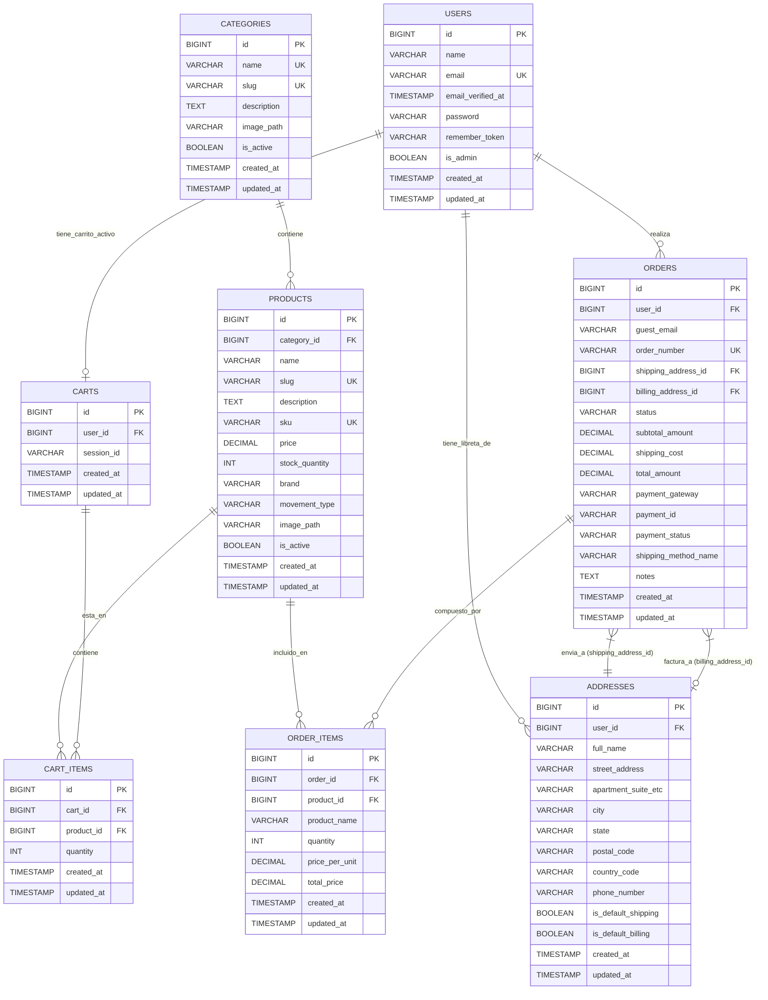

# 3. Modelo de Datos

**Moneda:** MXN (Pesos Mexicanos) para todos los campos monetarios.

**Entidades Principales:**

1.  **`users`** (Tabla ya existente por el starter kit de Laravel)
    * Gestiona la información de los clientes registrados.
    * **Campos:**
        | Columna             | Tipo                | Restricciones                     | Descripción                          |
        | :------------------ | :------------------ | :-------------------------------- | :----------------------------------- |
        | `id`                | `BIGINT UNSIGNED`   | PK, AI                            | Identificador único del usuario      |
        | `name`              | `VARCHAR(255)`      |                                   | Nombre completo del usuario          |
        | `email`             | `VARCHAR(255)`      | UNIQUE                            | Correo electrónico del usuario       |
        | `email_verified_at` | `TIMESTAMP`         | NULLABLE                          | Fecha de verificación del correo     |
        | `password`          | `VARCHAR(255)`      |                                   | Contraseña hasheada del usuario      |
        | `remember_token`    | `VARCHAR(100)`      | NULLABLE                          | Token para "recordarme"              |
        | `is_admin`          | `BOOLEAN`           | DEFAULT `false`                   | Indica si el usuario es administrador |
        | `created_at`        | `TIMESTAMP`         | NULLABLE                          | Fecha de creación                    |
        | `updated_at`        | `TIMESTAMP`         | NULLABLE                          | Fecha de última actualización        |
    * **Relaciones:**
        * Un `User` puede tener muchos `Order`s.
        * Un `User` puede tener muchas `Address`es (libreta de direcciones).
        * Un `User` puede tener un `Cart` (para carritos persistentes de usuarios logueados).

2.  **`categories`**
    * Organiza los productos (relojes) en diferentes categorías.
    * **Campos:**
        | Columna        | Tipo                | Restricciones                     | Descripción                                       |
        | :------------- | :------------------ | :-------------------------------- | :------------------------------------------------ |
        | `id`           | `BIGINT UNSIGNED`   | PK, AI                            | Identificador único de la categoría               |
        | `name`         | `VARCHAR(255)`      | UNIQUE                            | Nombre de la categoría                            |
        | `slug`         | `VARCHAR(255)`      | UNIQUE                            | Slug para URL amigable                            |
        | `description`  | `TEXT`              | NULLABLE                          | Descripción de la categoría                       |
        | `image_path`   | `VARCHAR(2048)`     | NULLABLE                          | **Ruta relativa a la imagen de la categoría (subida al servidor)** |
        | `is_active`    | `BOOLEAN`           | DEFAULT `true`                    | Indica si la categoría está activa                |
        | `created_at`   | `TIMESTAMP`         | NULLABLE                          | Fecha de creación                                 |
        | `updated_at`   | `TIMESTAMP`         | NULLABLE                          | Fecha de última actualización                     |
    * **Relaciones:**
        * Una `Category` puede tener muchos `Product`s.
        * *(Opcional MVP):* `parent_id` (FK a `categories.id`, NULLABLE) para subcategorías.

3.  **`products`** (Relojes)
    * Almacena la información de los relojes disponibles para la venta.
    * **Campos:**
        | Columna          | Tipo                | Restricciones                           | Descripción                                                            |
        | :--------------- | :------------------ | :-------------------------------------- | :--------------------------------------------------------------------- |
        | `id`             | `BIGINT UNSIGNED`   | PK, AI                                  | Identificador único del producto                                       |
        | `category_id`    | `BIGINT UNSIGNED`   | FK (categories.id), NULLABLE            | Categoría a la que pertenece el producto                               |
        | `name`           | `VARCHAR(255)`      |                                         | Nombre del reloj                                                       |
        | `slug`           | `VARCHAR(255)`      | UNIQUE                                  | Slug para URL amigable                                                 |
        | `description`    | `TEXT`              | NULLABLE                                | Descripción detallada del reloj                                        |
        | `sku`            | `VARCHAR(100)`      | UNIQUE, NULLABLE                        | SKU (Stock Keeping Unit)                                               |
        | `price`          | `DECIMAL(10, 2)`    |                                         | Precio del reloj en MXN                                                |
        | `stock_quantity` | `INT UNSIGNED`      | DEFAULT `0`                             | Cantidad en inventario                                                 |
        | `brand`          | `VARCHAR(100)`      | NULLABLE                                | Marca del reloj                                                        |
        | `movement_type`  | `VARCHAR(50)`       |                                         | Tipo de movimiento del reloj (ENUM: 'Automático', 'De Cuerda', 'Híbrido', 'Quartz') |
        | `image_path`     | `VARCHAR(2048)`     | NULLABLE                                | **Ruta relativa a la imagen principal del producto (subida al servidor)** |
        | `is_active`      | `BOOLEAN`           | DEFAULT `true`                          | Indica si el producto está visible en la tienda                        |
        | `created_at`     | `TIMESTAMP`         | NULLABLE                                | Fecha de creación                                                      |
        | `updated_at`     | `TIMESTAMP`         | NULLABLE                                | Fecha de última actualización                                          |
    * **Relaciones:**
        * Un `Product` pertenece a una `Category` (opcional).
        * Un `Product` puede estar en muchos `CartItem`s.
        * Un `Product` puede estar en muchos `OrderItem`s.

4.  **`carts`**
    * Representa el carrito de compras de un usuario (logueado o invitado).
    * **Campos:**
        | Columna      | Tipo                | Restricciones        | Descripción                                       |
        | :----------- | :------------------ | :------------------- | :------------------------------------------------ |
        | `id`         | `BIGINT UNSIGNED`   | PK, AI               | Identificador único del carrito                   |
        | `user_id`    | `BIGINT UNSIGNED`   | FK (users.id), NULLABLE, UNIQUE | Usuario al que pertenece el carrito (si está logueado) |
        | `session_id` | `VARCHAR(255)`      | NULLABLE, INDEX      | ID de sesión para carritos de invitados           |
        | `created_at` | `TIMESTAMP`         | NULLABLE             | Fecha de creación                                 |
        | `updated_at` | `TIMESTAMP`         | NULLABLE             | Fecha de última actualización                     |
    * **Relaciones:**
        * Un `Cart` puede pertenecer a un `User`.
        * Un `Cart` tiene muchos `CartItem`s.

5.  **`cart_items`**
    * Representa los productos individuales dentro de un carrito.
    * **Campos:**
        | Columna      | Tipo                | Restricciones        | Descripción                                 |
        | :----------- | :------------------ | :------------------- | :------------------------------------------ |
        | `id`         | `BIGINT UNSIGNED`   | PK, AI               | Identificador único del ítem del carrito    |
        | `cart_id`    | `BIGINT UNSIGNED`   | FK (carts.id)        | Carrito al que pertenece el ítem            |
        | `product_id` | `BIGINT UNSIGNED`   | FK (products.id)     | Producto añadido al carrito                 |
        | `quantity`   | `INT UNSIGNED`      | DEFAULT `1`          | Cantidad del producto en el carrito         |
        | `created_at` | `TIMESTAMP`         | NULLABLE             | Fecha de creación                           |
        | `updated_at` | `TIMESTAMP`         | NULLABLE             | Fecha de última actualización               |
    * **Restricción Adicional:** UNIQUE (`cart_id`, `product_id`).
    * **Relaciones:**
        * Un `CartItem` pertenece a un `Cart`.
        * Un `CartItem` pertenece a un `Product`.

6.  **`addresses`**
    * Almacena direcciones de envío y/o facturación (Libreta de direcciones del usuario).
    * **Campos:**
        | Columna               | Tipo                | Restricciones                | Descripción                                      |
        | :-------------------- | :------------------ | :--------------------------- | :----------------------------------------------- |
        | `id`                  | `BIGINT UNSIGNED`   | PK, AI                       | Identificador único de la dirección              |
        | `user_id`             | `BIGINT UNSIGNED`   | FK (users.id)                | Usuario al que pertenece la dirección            |
        | `full_name`           | `VARCHAR(255)`      |                              | Nombre completo del destinatario                 |
        | `street_address`      | `VARCHAR(255)`      |                              | Calle y número                                   |
        | `apartment_suite_etc` | `VARCHAR(255)`      | NULLABLE                     | Número interior, departamento, etc.              |
        | `city`                | `VARCHAR(100)`      |                              | Ciudad                                           |
        | `state`               | `VARCHAR(100)`      |                              | Estado/Provincia                                 |
        | `postal_code`         | `VARCHAR(20)`       |                              | Código Postal                                    |
        | `country_code`        | `VARCHAR(2)`        | DEFAULT `'MX'`               | Código de país (ISO 3166-1 alfa-2)             |
        | `phone_number`        | `VARCHAR(50)`       | NULLABLE                     | Número de teléfono de contacto                   |
        | `is_default_shipping` | `BOOLEAN`           | DEFAULT `false`              | Dirección de envío por defecto del usuario       |
        | `is_default_billing`  | `BOOLEAN`           | DEFAULT `false`              | Dirección de facturación por defecto del usuario |
        | `created_at`          | `TIMESTAMP`         | NULLABLE                     | Fecha de creación                                |
        | `updated_at`          | `TIMESTAMP`         | NULLABLE                     | Fecha de última actualización                    |
    * **Relaciones:**
        * Una `Address` pertenece a un `User`.
        * Una `Address` puede ser usada en muchos `Order`s (como dirección de envío o facturación referenciada desde la tabla `orders`).

7.  **`orders`**
    * Representa un pedido realizado por un cliente.
    * **Campos:**
        | Columna               | Tipo                | Restricciones                           | Descripción                                     |
        | :-------------------- | :------------------ | :-------------------------------------- | :---------------------------------------------- |
        | `id`                  | `BIGINT UNSIGNED`   | PK, AI                                  | Identificador único del pedido                  |
        | `user_id`             | `BIGINT UNSIGNED`   | FK (users.id), NULLABLE                 | Usuario que realizó el pedido                   |
        | `guest_email`         | `VARCHAR(255)`      | NULLABLE                                | Email del invitado                              |
        | `order_number`        | `VARCHAR(32)`       | UNIQUE                                  | Número de pedido único                          |
        | `shipping_address_id` | `BIGINT UNSIGNED`   | FK (addresses.id)                       | Dirección de envío del pedido                   |
        | `billing_address_id`  | `BIGINT UNSIGNED`   | FK (addresses.id), NULLABLE             | Dirección de facturación del pedido             |
        | `status`              | `VARCHAR(50)`       | DEFAULT `'pendiente_pago'`              | Estado actual del pedido (ENUM: 'pendiente_pago', 'procesando', 'enviado', 'entregado', 'cancelado') |
        | `subtotal_amount`     | `DECIMAL(10, 2)`    |                                         | Suma de los precios de los ítems                |
        | `shipping_cost`       | `DECIMAL(10, 2)`    | DEFAULT `0.00`                          | Costo del envío                                 |
        | `total_amount`        | `DECIMAL(10, 2)`    |                                         | Monto total del pedido                          |
        | `payment_gateway`     | `VARCHAR(50)`       | NULLABLE                                | Pasarela de pago utilizada                      |
        | `payment_id`          | `VARCHAR(255)`      | NULLABLE, INDEX                         | ID de la transacción en la pasarela             |
        | `payment_status`      | `VARCHAR(50)`       | DEFAULT `'pendiente'`                   | Estado del pago (ENUM: 'pendiente', 'pagado', 'fallido', 'reembolsado') |
        | `shipping_method_name`| `VARCHAR(100)`      | NULLABLE                                | Nombre del método de envío                      |
        | `notes`               | `TEXT`              | NULLABLE                                | Notas adicionales                               |
        | `created_at`          | `TIMESTAMP`         | NULLABLE                                | Fecha de creación                               |
        | `updated_at`          | `TIMESTAMP`         | NULLABLE                                | Fecha de última actualización                   |
    * **Relaciones:**
        * Un `Order` pertenece a un `User` (opcional).
        * Un `Order` tiene muchos `OrderItem`s.
        * Un `Order` tiene una `Address` de envío (relación `belongsTo`).
        * Un `Order` tiene una `Address` de facturación (relación `belongsTo`).

8.  **`order_items`**
    * Representa los productos individuales dentro de un pedido.
    * **Campos:**
        | Columna          | Tipo                | Restricciones           | Descripción                                      |
        | :--------------- | :------------------ | :---------------------- | :----------------------------------------------- |
        | `id`             | `BIGINT UNSIGNED`   | PK, AI                  | Identificador único del ítem del pedido          |
        | `order_id`       | `BIGINT UNSIGNED`   | FK (orders.id)          | Pedido al que pertenece el ítem                  |
        | `product_id`     | `BIGINT UNSIGNED`   | FK (products.id), NULLABLE | Producto comprado                               |
        | `product_name`   | `VARCHAR(255)`      |                         | Nombre del producto al momento de la compra      |
        | `quantity`       | `INT UNSIGNED`      |                         | Cantidad del producto comprada                   |
        | `price_per_unit` | `DECIMAL(10, 2)`    |                         | Precio unitario al momento de la compra          |
        | `total_price`    | `DECIMAL(10, 2)`    |                         | Precio total para este ítem (cantidad * precio)  |
        | `created_at`     | `TIMESTAMP`         | NULLABLE                | Fecha de creación                                |
        | `updated_at`     | `TIMESTAMP`         | NULLABLE                | Fecha de última actualización                    |
    * **Relaciones:**
        * Un `OrderItem` pertenece a un `Order`.
        * Un `OrderItem` referencia a un `Product`.

**Diagrama de Entidad-Relación (Conceptual en Mermaid ERD)**

