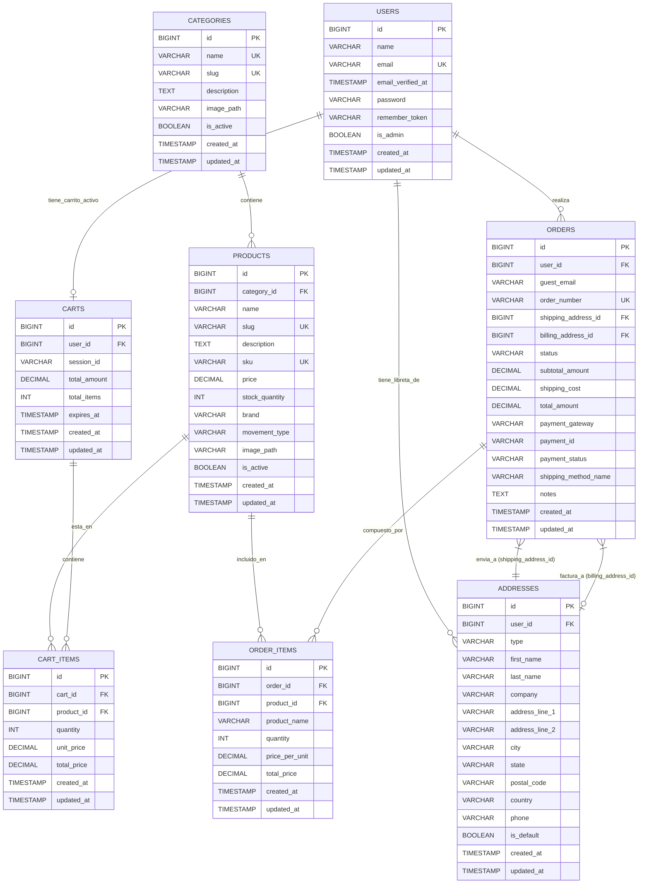

# 3. Modelo de Datos

**Moneda:** MXN (Pesos Mexicanos) para todos los campos monetarios.

**Entidades Principales:**

1.  **`users`** (Tabla ya existente por el starter kit de Laravel)
    * Gestiona la información de los clientes registrados.
    * **Campos:**
        | Columna             | Tipo                | Restricciones                     | Descripción                          |
        | :------------------ | :------------------ | :-------------------------------- | :----------------------------------- |
        | `id`                | `BIGINT UNSIGNED`   | PK, AI                            | Identificador único del usuario      |
        | `name`              | `VARCHAR(255)`      |                                   | Nombre completo del usuario          |
        | `email`             | `VARCHAR(255)`      | UNIQUE                            | Correo electrónico del usuario       |
        | `email_verified_at` | `TIMESTAMP`         | NULLABLE                          | Fecha de verificación del correo     |
        | `password`          | `VARCHAR(255)`      |                                   | Contraseña hasheada del usuario      |
        | `remember_token`    | `VARCHAR(100)`      | NULLABLE                          | Token para "recordarme"              |
        | `is_admin`          | `BOOLEAN`           | DEFAULT `false`                   | Indica si el usuario es administrador |
        | `created_at`        | `TIMESTAMP`         | NULLABLE                          | Fecha de creación                    |
        | `updated_at`        | `TIMESTAMP`         | NULLABLE                          | Fecha de última actualización        |
    * **Relaciones:**
        * Un `User` puede tener muchos `Order`s.
        * Un `User` puede tener muchas `Address`es (libreta de direcciones).
        * Un `User` puede tener un `Cart` (para carritos persistentes de usuarios logueados).

2.  **`categories`**
    * Organiza los productos (relojes) en diferentes categorías.
    * **Campos:**
        | Columna        | Tipo                | Restricciones                     | Descripción                                       |
        | :------------- | :------------------ | :-------------------------------- | :------------------------------------------------ |
        | `id`           | `BIGINT UNSIGNED`   | PK, AI                            | Identificador único de la categoría               |
        | `name`         | `VARCHAR(255)`      | UNIQUE                            | Nombre de la categoría                            |
        | `slug`         | `VARCHAR(255)`      | UNIQUE                            | Slug para URL amigable                            |
        | `description`  | `TEXT`              | NULLABLE                          | Descripción de la categoría                       |
        | `image_path`   | `VARCHAR(2048)`     | NULLABLE                          | **Ruta relativa a la imagen de la categoría (subida al servidor)** |
        | `is_active`    | `BOOLEAN`           | DEFAULT `true`                    | Indica si la categoría está activa                |
        | `created_at`   | `TIMESTAMP`         | NULLABLE                          | Fecha de creación                                 |
        | `updated_at`   | `TIMESTAMP`         | NULLABLE                          | Fecha de última actualización                     |
    * **Relaciones:**
        * Una `Category` puede tener muchos `Product`s.
        * *(Opcional MVP):* `parent_id` (FK a `categories.id`, NULLABLE) para subcategorías.

3.  **`products`** (Relojes)
    * Almacena la información de los relojes disponibles para la venta.
    * **Campos:**
        | Columna          | Tipo                | Restricciones                           | Descripción                                                            |
        | :--------------- | :------------------ | :-------------------------------------- | :--------------------------------------------------------------------- |
        | `id`             | `BIGINT UNSIGNED`   | PK, AI                                  | Identificador único del producto                                       |
        | `category_id`    | `BIGINT UNSIGNED`   | FK (categories.id), NULLABLE            | Categoría a la que pertenece el producto                               |
        | `name`           | `VARCHAR(255)`      |                                         | Nombre del reloj                                                       |
        | `slug`           | `VARCHAR(255)`      | UNIQUE                                  | Slug para URL amigable                                                 |
        | `description`    | `TEXT`              | NULLABLE                                | Descripción detallada del reloj                                        |
        | `sku`            | `VARCHAR(100)`      | UNIQUE, NULLABLE                        | SKU (Stock Keeping Unit)                                               |
        | `price`          | `DECIMAL(8, 2)`     |                                         | Precio del reloj en MXN                                                |
        | `stock_quantity` | `INT UNSIGNED`      | DEFAULT `0`                             | Cantidad en inventario                                                 |
        | `brand`          | `VARCHAR(100)`      | NULLABLE                                | Marca del reloj                                                        |
        | `movement_type`  | `VARCHAR(50)`       |                                         | Tipo de movimiento del reloj (ENUM: 'Automático', 'De Cuerda', 'Híbrido', 'Quartz') |
        | `image_path`     | `VARCHAR(2048)`     | NULLABLE                                | **Ruta relativa a la imagen principal del producto (subida al servidor)** |
        | `is_active`      | `BOOLEAN`           | DEFAULT `true`                          | Indica si el producto está visible en la tienda                        |
        | `created_at`     | `TIMESTAMP`         | NULLABLE                                | Fecha de creación                                                      |
        | `updated_at`     | `TIMESTAMP`         | NULLABLE                                | Fecha de última actualización                                          |
    * **Relaciones:**
        * Un `Product` pertenece a una `Category` (opcional).
        * Un `Product` puede estar en muchos `CartItem`s.
        | `total_amount`   | `DECIMAL(10, 2)`    | DEFAULT `0.00`       | Monto total del carrito (calculado)               |
        | `total_items`    | `INT UNSIGNED`      | DEFAULT `0`          | Número total de ítems en el carrito               |
        | `expires_at`     | `TIMESTAMP`         | NULLABLE             | Fecha de expiración para carritos de invitados    |
        | `created_at`     | `TIMESTAMP`         | NULLABLE             | Fecha de creación                                 |
        | `updated_at`     | `TIMESTAMP`         | NULLABLE             | Fecha de última actualización                     |
    * **Relaciones:**
        * Un `Cart` puede pertenecer a un `User`.
        * Un `Cart` tiene muchos `CartItem`s (relación `items()`).

5.  **`cart_items`**
    * Representa los productos individuales dentro de un carrito.
    * **Campos:**
        | Columna       | Tipo                | Restricciones        | Descripción                                 |
        | :------------ | :------------------ | :------------------- | :------------------------------------------ |
        | `id`          | `BIGINT UNSIGNED`   | PK, AI               | Identificador único del ítem del carrito    |
        | `cart_id`     | `BIGINT UNSIGNED`   | FK (carts.id)        | Carrito al que pertenece el ítem            |
        | `product_id`  | `BIGINT UNSIGNED`   | FK (products.id)     | Producto añadido al carrito                 |
        | `quantity`    | `INT UNSIGNED`      | DEFAULT `1`          | Cantidad del producto en el carrito         |
        | `unit_price`  | `DECIMAL(8, 2)`     |                      | Precio unitario del producto al momento de añadir |
        | `total_price` | `DECIMAL(10, 2)`    |                      | Precio total del ítem (quantity * unit_price) |
        | `created_at`  | `TIMESTAMP`         | NULLABLE             | Fecha de creación                           |
        | `updated_at`  | `TIMESTAMP`         | NULLABLE             | Fecha de última actualización               |
    * **Restricción Adicional:** UNIQUE (`cart_id`, `product_id`).
    * **Relaciones:**
        * Un `CartItem` pertenece a un `Cart`.
        * Un `CartItem` pertenece a un `Product`.

6.  **`addresses`**
    * Almacena direcciones de envío y/o facturación (Libreta de direcciones del usuario).
    * **Campos:**
        | Columna           | Tipo                | Restricciones                | Descripción                                      |
        | :---------------- | :------------------ | :--------------------------- | :----------------------------------------------- |
        | `id`              | `BIGINT UNSIGNED`   | PK, AI                       | Identificador único de la dirección              |
        | `user_id`         | `BIGINT UNSIGNED`   | FK (users.id)                | Usuario al que pertenece la dirección            |
        | `type`            | `VARCHAR(50)`       | DEFAULT `'shipping'`         | Tipo de dirección ('shipping' o 'billing')      |
        | `first_name`      | `VARCHAR(255)`      |                              | Nombre del destinatario                          |
        | `last_name`       | `VARCHAR(255)`      |                              | Apellido del destinatario                        |
        | `company`         | `VARCHAR(255)`      | NULLABLE                     | Nombre de la empresa (opcional)                  |
        | `address_line_1`  | `VARCHAR(255)`      |                              | Línea principal de dirección (calle y número)   |
        | `address_line_2`  | `VARCHAR(255)`      | NULLABLE                     | Línea secundaria (colonia, depto, etc.)         |
        | `city`            | `VARCHAR(255)`      |                              | Ciudad                                           |
        | `state`           | `VARCHAR(255)`      |                              | Estado/Provincia                                 |
        | `postal_code`     | `VARCHAR(20)`       |                              | Código Postal                                    |
        | `country`         | `VARCHAR(255)`      |                              | País completo                                    |
        | `phone`           | `VARCHAR(50)`       | NULLABLE                     | Número de teléfono de contacto                   |
        | `is_default`      | `BOOLEAN`           | DEFAULT `false`              | Dirección por defecto para el tipo especificado |
        | `created_at`      | `TIMESTAMP`         | NULLABLE                     | Fecha de creación                                |
        | `updated_at`      | `TIMESTAMP`         | NULLABLE                     | Fecha de última actualización                    |
    * **Índices:**
        * INDEX (`user_id`, `type`) - Para búsquedas por usuario y tipo
        * INDEX (`user_id`, `is_default`) - Para direcciones por defecto
    * **Relaciones:**
        * Una `Address` pertenece a un `User`.
        * Una `Address` puede ser usada en muchos `Order`s (como dirección de envío o facturación).
        * **Accessor:** `full_name` (computed: `first_name` + `last_name`)
        * **Accessor:** `full_address` (computed: dirección completa formateada)

7.  **`orders`**
    * Representa un pedido realizado por un cliente.
    | Columna               | Tipo                | Restricciones                           | Descripción                                     |
    | :-------------------- | :------------------ | :-------------------------------------- | :---------------------------------------------- |
    | `id`                  | `BIGINT UNSIGNED`   | PK, AI                                  | Identificador único del pedido                  |
    | `user_id`             | `BIGINT UNSIGNED`   | FK (users.id), NULLABLE                 | Usuario que realizó el pedido                   |
    | `guest_email`         | `VARCHAR(255)`      | NULLABLE                                | Email del invitado                              |
    | `order_number`        | `VARCHAR(32)`       | UNIQUE                                  | Número de pedido único                          |
    | `shipping_address_id` | `BIGINT UNSIGNED`   | FK (addresses.id)                       | Dirección de envío del pedido                   |
    | `billing_address_id`  | `BIGINT UNSIGNED`   | FK (addresses.id), NULLABLE             | Dirección de facturación del pedido             |
    | `status`              | `VARCHAR(50)`       | DEFAULT `'pendiente_pago'`              | Estado actual del pedido (ENUM: 'pendiente_pago', 'procesando', 'enviado', 'entregado', 'cancelado') |
    | `subtotal_amount`     | `DECIMAL(10, 2)`    |                                         | Suma de los precios de los ítems                |
    | `shipping_cost`       | `DECIMAL(10, 2)`    | DEFAULT `0.00`                          | Costo del envío                                 |
    | `total_amount`        | `DECIMAL(10, 2)`    |                                         | Monto total del pedido                          |
    | `payment_gateway`     | `VARCHAR(50)`       | NULLABLE                                | Pasarela de pago utilizada                      |
    | `payment_id`          | `VARCHAR(255)`      | NULLABLE, INDEX                         | ID de la transacción en la pasarela             |
    | `payment_status`      | `VARCHAR(50)`       | DEFAULT `'pendiente'`                   | Estado del pago (ENUM: 'pendiente', 'pagado', 'fallido', 'reembolsado') |
    | `shipping_method_name`| `VARCHAR(100)`      | NULLABLE                                | Nombre del método de envío                      |
    | `notes`               | `TEXT`              | NULLABLE                                | Notas adicionales                               |
    | `created_at`          | `TIMESTAMP`         | NULLABLE                                | Fecha de creación                               |
    | `updated_at`          | `TIMESTAMP`         | NULLABLE                                | Fecha de última actualización                   |
    * **Índices:**
        * INDEX (`user_id`, `created_at`) - Para historial de pedidos
        * INDEX (`guest_email`, `created_at`) - Para pedidos de invitados
        * INDEX (`status`) - Para filtros por estado
        * INDEX (`payment_status`) - Para filtros por estado de pago
    * **Relaciones:**
        * Un `Order` pertenece a un `User` (opcional).
        * Un `Order` tiene muchos `OrderItem`s.
        * Un `Order` tiene una `Address` de envío (relación `shippingAddress()`).
        * Un `Order` tiene una `Address` de facturación (relación `billingAddress()`).

8.  **`order_items`**
    * Representa los productos individuales dentro de un pedido.
    * **Campos:**
        | Columna          | Tipo                | Restricciones           | Descripción                                      |
        | :--------------- | :------------------ | :---------------------- | :----------------------------------------------- |
        | `id`             | `BIGINT UNSIGNED`   | PK, AI                  | Identificador único del ítem del pedido          |
        | `order_id`       | `BIGINT UNSIGNED`   | FK (orders.id)          | Pedido al que pertenece el ítem                  |
        | `product_id`     | `BIGINT UNSIGNED`   | FK (products.id), NULLABLE | Producto comprado                               |
        | `product_name`   | `VARCHAR(255)`      |                         | Nombre del producto al momento de la compra      |
        | `quantity`       | `INT UNSIGNED`      |                         | Cantidad del producto comprada                   |
        | `price_per_unit` | `DECIMAL(10, 2)`    |                         | Precio unitario al momento de la compra          |
        | `total_price`    | `DECIMAL(10, 2)`    |                         | Precio total para este ítem (cantidad * precio)  |
        | `created_at`     | `TIMESTAMP`         | NULLABLE                | Fecha de creación                                |
        | `updated_at`     | `TIMESTAMP`         | NULLABLE                | Fecha de última actualización                    |
    * **Índices:**
        * INDEX (`order_id`) - Para consultas por pedido
        * INDEX (`product_id`) - Para estadísticas de productos
    * **Relaciones:**
        * Un `OrderItem` pertenece a un `Order`.
        * Un `OrderItem` referencia a un `Product`.

**Diagrama de Entidad-Relación (Conceptual en Mermaid ERD)**

## Diferencias Implementadas vs Documentación Original

**Nota Importante:** Este modelo de datos refleja la implementación actual del sistema, que incluye mejoras y optimizaciones sobre la especificación original:

### Tabla `addresses`:
- **Mejora:** Separación de `full_name` en `first_name` y `last_name` para mejor experiencia de usuario en formularios
- **Mejora:** Campo `company` para direcciones comerciales
- **Mejora:** Sistema de `type` + `is_default` más escalable que campos separados para shipping/billing
- **Mejora:** Campo `country` completo en lugar de código de 2 caracteres para mejor usabilidad
- **Mejora:** Campo `phone` en lugar de `phone_number` para consistencia

### Tabla `carts`:
- **Mejora:** Campos `total_amount` y `total_items` para rendimiento optimizado
- **Mejora:** Campo `expires_at` para gestión automática de carritos de invitados

### Tabla `cart_items`:
- **Mejora:** Campos `unit_price` y `total_price` para histórico de precios y cálculos optimizados

### Relaciones:
- **Mejora:** Método `items()` en lugar de `cartItems()` para mejor consistencia con convenciones de Laravel
- **Mejora:** Accessors `full_name` y `full_address` en Address para compatibilidad
