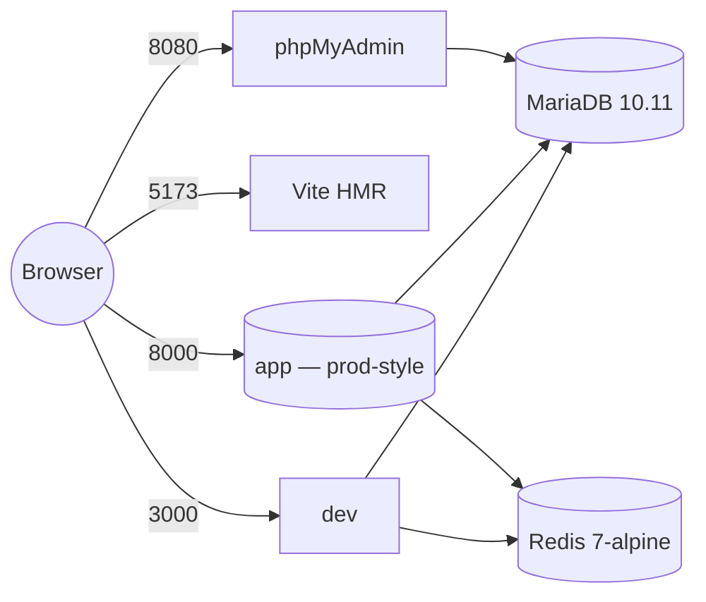

# Deployment Guide — CronosMatic Store

> Generated: 2026-05-07 — Code-derived from `docker-compose.yml`, `Dockerfile`, `docker/`, `.github/workflows/`, and existing notes.

## Deployment surfaces

CronosMatic Store ships with two Docker images defined in the same repo:

| Image | Purpose | Port (host) | Internal | Includes |
| --- | --- | --- | --- | --- |
| `Dockerfile` | Production-style build | `8000` (compose service `app`) | `80` | PHP 8.2-FPM + Nginx + supervisord + Composer prod deps + `npm run build` artifacts |
| `Dockerfile.dev` | Local development | `3000`, `5173` (compose service `dev`) | `3000`, `5173` | Same base + dev composer/npm + Vite dev server + Cypress system deps + supervisord.dev.conf |

The MVP is intended to run on a single VPS or a PaaS that can pull from this repo and build the production image.

## Production image (`Dockerfile`)

Layered build:

1. `FROM php:8.2-fpm`
2. Install OS deps + PHP extensions: `pdo_mysql, mbstring, exif, pcntl, bcmath, gd, zip` and `redis` via PECL.
3. Install Node 18 from NodeSource (used by `npm run build`).
4. Install Cypress deps (`xvfb`, `libgtk-*`, `libgbm-dev`, `libnotify-dev`, `libnss3`, `libxss1`, `libasound2`, `libxtst6`, `xauth`) — kept in the production image to make it possible to run E2E in this image too.
5. `composer install --no-dev --optimize-autoloader --no-interaction --no-scripts`.
6. `npm ci --only=production` (note: this excludes dev dependencies; if you ever need `vite build` here, adjust to `npm ci`).
7. Copy app source + `composer run-script post-autoload-dump`.
8. `chown www-data:www-data` and chmod `storage/`, `bootstrap/cache/`.
9. `npm run build` → builds Vite assets to `public/build/`.
10. Copy `docker/php/custom.ini`, `docker/nginx.conf`, `docker/supervisord.conf`.
11. `EXPOSE 80`, `CMD supervisord -c /etc/supervisor/conf.d/supervisord.conf`.

> **Heads-up:** step 6 (`npm ci --only=production`) strips dev deps; if Vite/Tailwind plugins are listed under `devDependencies` (they are), the subsequent `npm run build` works because step 6 does not actually drop them in `npm@9+` (the flag is `--omit=dev`). Verify image size and the contents of `public/build/` after a build before relying on this in production.

## Compose services

`docker-compose.yml` defines five services:



| Service | Image / Build | Container name | Volumes | Healthcheck |
| --- | --- | --- | --- | --- |
| `app` | `Dockerfile` | `cronosmatic_app` | `./:/var/www/html`, anonymous `vendor` and `node_modules` overlays, `docker/php/custom.ini`, `docker/nginx.conf`, `docker/supervisord.conf` | depends_on db + db_test + redis (all healthy) |
| `dev` | `Dockerfile.dev` | `cronosmatic_dev` | Same shared volume but with `supervisord.dev.conf` and the dev start script | depends_on db + db_test + redis |
| `db` | `mariadb:10.11` | `cronosmatic_db` | `db_data:/var/lib/mysql`, `docker/mysql/init.sql:/docker-entrypoint-initdb.d/init.sql` | `healthcheck.sh --connect --innodb_initialized`, every 10s |
| `db_test` | `mariadb:10.11` | `cronosmatic_db_test` | `db_test_data:/var/lib/mysql` (separate volume from `db_data`) | Same healthcheck. Used by **all `make test-*` targets**; never holds dev data. |
| `redis` | `redis:7-alpine` | `cronosmatic_redis` | `redis_data:/data` | `redis-cli ping` every 5s |
| `phpmyadmin` | `phpmyadmin/phpmyadmin:latest` | `cronosmatic_phpmyadmin` | — | depends_on db |

All services share the `cronosmatic_network` bridge. Volumes `db_data`, `db_test_data` and `redis_data` are local-driver persistent.

### Port allocation

| Host port | Container | Mapped to |
| --- | --- | --- |
| 3000 | `dev` | Laravel `php artisan serve` (started via supervisord.dev.conf) |
| 5173 | `dev` | Vite dev server (HMR) |
| 8000 | `app` | Nginx → PHP-FPM (production-style) |
| 3306 | `db` | MariaDB (development DB `cronosmatic`) |
| 3307 | `db_test` | MariaDB (testing DB `cronosmatic_test`) — **only used by tests** |
| 6379 | `redis` | Redis |
| 8080 | `phpmyadmin` | phpMyAdmin web UI |

### Compose env summary

Both `dev` and `app` services receive these env vars from `docker-compose.yml`:

```
APP_ENV=local
APP_DEBUG=true
APP_KEY=${APP_KEY}                  # taken from host .env (must exist before `make fresh`)
APP_NAME="CronosMatic Store"
APP_URL=http://localhost:{3000|8000}
DB_CONNECTION=mariadb
DB_HOST=db   DB_PORT=3306   DB_DATABASE=cronosmatic
DB_USERNAME=cronosmatic   DB_PASSWORD=cronosmatic_password
REDIS_HOST=redis   REDIS_PORT=6379
REDIS_DB=0   REDIS_CACHE_DB=1
QUEUE_CONNECTION=redis
SESSION_DRIVER=redis
CACHE_DRIVER=redis
```

For real production, override `APP_ENV=production`, `APP_DEBUG=false`, and use a strong `APP_KEY` and unique DB credentials.

## CI/CD — GitHub Actions

Three workflows under `.github/workflows/`:

### `tests.yml` — full suite on push/PR to `develop`/`main`

Three jobs (the third depends on the first two):

1. **`backend-tests`** — PHP 8.4, Node 22.
   - `composer install` + `npm ci` + `npm run build`.
   - Copy `.env.example` → `.env`, `php artisan key:generate`, create `database/testing.sqlite`.
   - Run `./vendor/bin/phpunit` (i.e. all PHPUnit suites: Unit + Feature).
2. **`frontend-tests`** — PHP 8.4 + Node 22.
   - `composer install` + `npm ci`.
   - `php artisan ziggy:generate --types` (writes typed routes for the frontend).
   - `npm run types` + `npm run test:run` + `npm run test:coverage`.
   - Codecov upload (flag: `frontend`).
3. **`e2e-tests`** — same setup as backend, plus:
   - `npm run build` (production assets).
   - SQLite DB + migrations + seeders.
   - `php artisan serve` in background, wait for `http://localhost:8000`.
   - `cypress-io/github-action@v6` with `wait-on http://localhost:8000`, browser `chrome`.
   - Upload screenshots on failure, videos always.

### `frontend-tests.yml` — on changes under `resources/js`, `resources/css`, package files, vitest/cypress/tsconfig

Single fast job: types + lint + Vitest + coverage upload + Cobertura PR comment. No backend setup required (it does still install composer because Ziggy is invoked by the type-check pipeline; check whether you can drop it).

### `lint.yml` — on push/PR to `develop`/`main`

PHP 8.4 + Node. Runs `vendor/bin/pint`, `npm run format`, `npm run lint`. Auto-commit step is currently commented out — devs run formatters locally.

## Production checklist

Before promoting a build:

1. **Secrets**:
   - `APP_KEY` (32-byte base64; `php artisan key:generate`).
   - `APP_URL` matching the public domain.
   - `DB_*` to managed MySQL/MariaDB.
   - `REDIS_*` to a managed/clustered Redis.
   - `MAIL_*` to a real provider (SES, Resend, Postmark, SMTP — `config/services.php` already wires SES, Resend, Postmark; `OrderConfirmationMail` is `ShouldQueue`).
   - `PAYPAL_MODE=live`, `PAYPAL_CLIENT_ID`, `PAYPAL_CLIENT_SECRET`, `PAYPAL_SIMULATE_PAYMENTS=false`.
2. **Storage**:
   - `php artisan storage:link` so `/storage` URLs resolve to `storage/app/public/` (used for product/category image uploads — see `ImageUploadController`).
3. **Migrations & data**:
   - `php artisan migrate --force` on first deploy.
   - Run `AdminUserSeeder` (or seed manually with `make tinker`) so an admin exists.
4. **Performance**:
   - `php artisan config:cache && route:cache && view:cache` (`make optimize`).
   - `npm run build` — assets shipped under `public/build/`.
   - Redis-backed `SESSION_DRIVER`, `CACHE_STORE`, `QUEUE_CONNECTION`.
5. **Workers**:
   - Run `php artisan queue:work --tries=3` (or `queue:work redis`) under supervisord. Without this, order confirmation emails won't actually leave.
6. **Cron**:
   - `* * * * * php artisan schedule:run` (no scheduled tasks today, but ready for future use).
7. **HTTPS / TLS**:
   - Terminate at the load balancer or use Nginx + Let's Encrypt. Update `APP_URL` accordingly so PayPal `return_url`/`cancel_url` (in `PayPalPaymentService::buildOrderData`) point to HTTPS.
8. **Hardening**:
   - `APP_DEBUG=false`.
   - Add `auth:sanctum` + ownership check to `/api/v1/payments/paypal/*` (currently public; see `docs/api-contracts.md` open issues).
   - Configure CORS in `config/cors.php` if hosting frontend on a different domain.
   - `EnsureUserIsAdmin` already returns 403 JSON; consider rate-limiting login (`throttle:6,1`-style on `/auth/*`).
9. **Backups**:
   - Cron the production equivalent of `make db-backup` to a remote bucket. Local `backups/` is for dev only.
10. **Observability**:
    - PHP logs: `storage/logs/laravel.log`. PayPal calls log via `Illuminate\Support\Facades\Log` with order ids — wire those to your aggregator.
    - Health endpoint: `GET /up` (Laravel built-in via `bootstrap/app.php`'s `withRouting(health: '/up')`) and `GET /api/v1/status`.

## Rollback plan

- Tag releases (`git tag v0.x.y`) and pin Docker images by digest.
- Keep the previous image in your registry. Roll back by re-deploying the previous tag.
- `php artisan migrate:rollback --step=1` undoes the last migration batch — but irreversible migrations exist (`2025_06_11_213746_modify_addresses_table_for_guest_users.php` throws on `down()`), so plan forward-fix migrations rather than rollback for schema changes.

## Common deployment commands

```bash
# Build prod image
docker build -t cronosmatic-store:$(git rev-parse --short HEAD) .

# Run migrations on a deployed container
docker compose exec app php artisan migrate --force

# Seed an initial admin (one-off)
docker compose exec app php artisan tinker
> App\Models\User::factory()->create(['name'=>'Admin','email'=>'admin@yourdomain.com','password'=>bcrypt('SECRET'),'is_admin'=>true]);

# Clear caches after env changes
docker compose exec app php artisan config:clear && cache:clear && route:clear && view:clear

# Tail logs
docker compose logs -f app
```

## Known infrastructure quirks

- `Dockerfile` and `Dockerfile.dev` install the **full Cypress dependency set** (xvfb, libgtk, etc.). This bloats the image. If size matters, split production image to drop them.
- Compose mounts the project directory into the container but uses anonymous volumes for `vendor/` and `node_modules/` to keep host-installed dependencies from leaking into the container.
- `docker/mysql/init.sql` is referenced in `docker-compose.yml` for the db init; check it exists in the deployment context.
- `docker-setup.sh` is the convenience wrapper used by README; it ultimately just calls `docker compose up -d`. Make sure `APP_KEY` is in your host `.env` before running `make fresh`, otherwise the compose env interpolation will produce an empty key.
